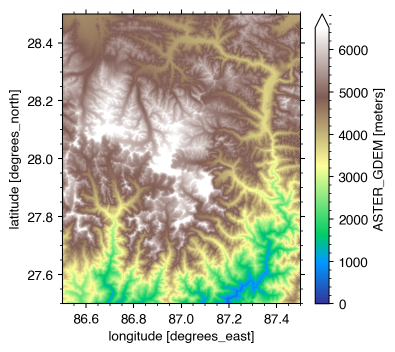
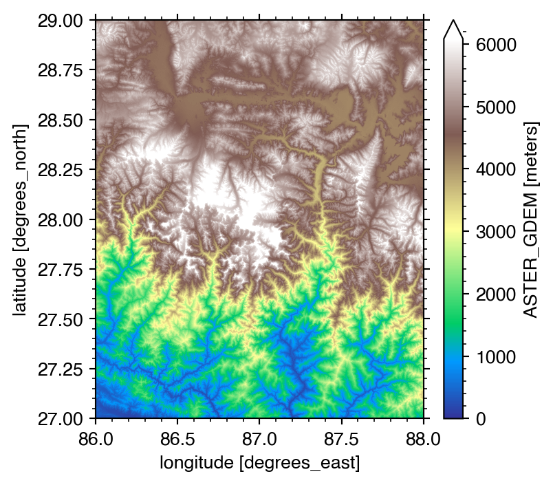
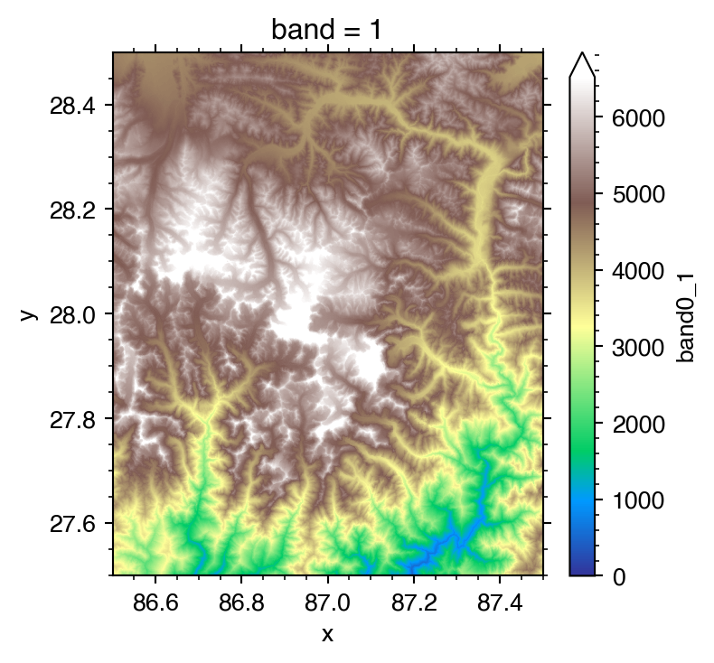
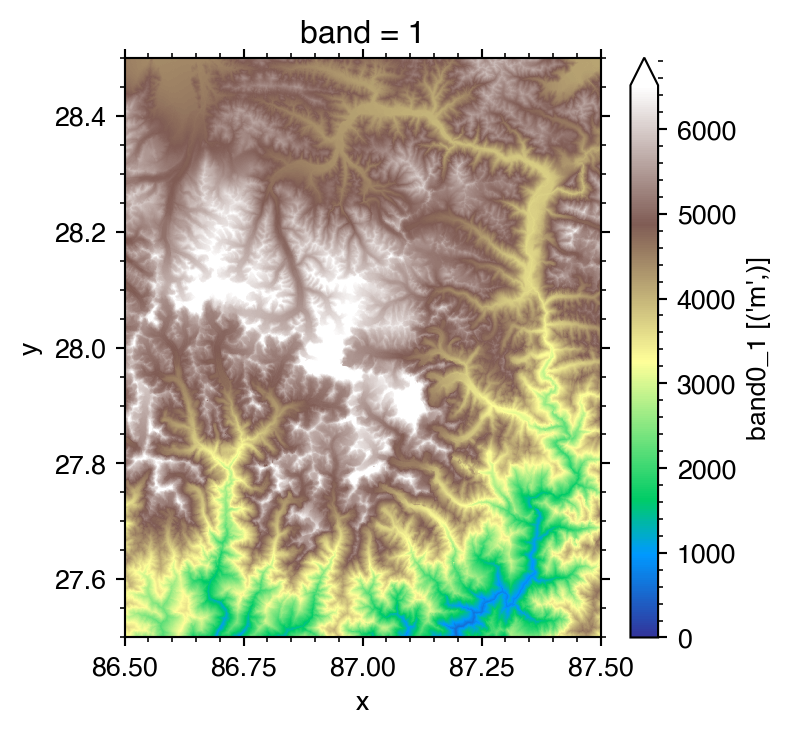
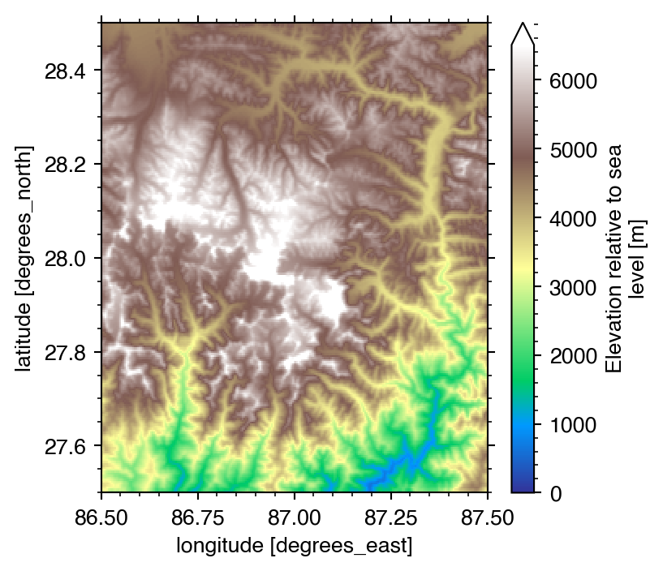

rasterx
=======
A python package for easy handling of raster datasets with [xarray](http://xarray.pydata.org/en/stable/index.html).
It is an open-source project dedicated to provide general tools for
interacting with raster datasets. It adds extra functionality, specific
for geo-raster files, on top of xarray's built in functionality. This functionality is accessible through the `.geo` dataset accessor.

Install
-------

Clone the repo by typing:

```shell
$ git clone https://github.com/shaharkadmiel/rasterx.git
```

and install with:

```shell
$ cd rasterx
$ pip install -e .
```

Demo
----

```python
from rasterx import read
```

# The `read` function

The read function is a universal function that will try many different reading methods until all options are exhausted. Here are some examples:

## Merging tiles
By pointing to a directory and specifying a bounding box, a list of files to be merged is generated and a merged mosaic of all the relevant tiles is returned after it has been trimmed to the requested extent.


```python
extent = (86.5, 87.5, 27.5, 28.5)
topo = read('/Users/shahar/data/AsterGDEM', extent=extent)
print(topo)

print('dx:', topo.geo.dx, 'dy:', topo.geo.dy)
```

    Reading 4 tiles:
    /Users/shahar/data/AsterGDEM/ASTGTMV003_N27E086_dem.nc
    /Users/shahar/data/AsterGDEM/ASTGTMV003_N27E087_dem.nc
    /Users/shahar/data/AsterGDEM/ASTGTMV003_N28E086_dem.nc
    /Users/shahar/data/AsterGDEM/ASTGTMV003_N28E087_dem.nc
    Merging tiles... be patient, this may take some time...
    <xarray.Dataset>
    Dimensions:         (lat: 3601, lon: 3600)
    Coordinates:
      * lat             (lat) float64 27.5 27.5 27.5 27.5 ... 28.5 28.5 28.5 28.5
      * lon             (lon) float64 86.5 86.5 86.5 86.5 ... 87.5 87.5 87.5 87.5
    Data variables:
        ASTER_GDEM_DEM  (lat, lon) float32 3006.0 3018.0 3030.0 ... 4157.0 4158.0
        crs             |S1 b''
    dx: 0.0002777777777822621 dy: 0.00027777777777515666


```python
topo.ASTER_GDEM_DEM.plot.imshow(
    cmap='terrain', vmin=0, robust=True,
    aspect=1, size=4, interpolation='nearest'
)
```



It is also possible to explicitly specify a list of filenames to be merged into a mosaic of tiles:

```python
files = ['/Users/shahar/data/AsterGDEM/ASTGTMV003_N27E086_dem.nc',
         '/Users/shahar/data/AsterGDEM/ASTGTMV003_N27E087_dem.nc',
         '/Users/shahar/data/AsterGDEM/ASTGTMV003_N28E086_dem.nc',
         '/Users/shahar/data/AsterGDEM/ASTGTMV003_N28E087_dem.nc']

topo = read(files)
print(topo)

print('dx:', topo.geo.dx, 'dy:', topo.geo.dy)
```

    Reading 4 tiles:
    /Users/shahar/data/AsterGDEM/ASTGTMV003_N27E086_dem.nc
    /Users/shahar/data/AsterGDEM/ASTGTMV003_N27E087_dem.nc
    /Users/shahar/data/AsterGDEM/ASTGTMV003_N28E086_dem.nc
    /Users/shahar/data/AsterGDEM/ASTGTMV003_N28E087_dem.nc
    Merging tiles... be patient, this may take some time...
    <xarray.Dataset>
    Dimensions:         (lat: 7202, lon: 7201)
    Coordinates:
      * lat             (lat) float64 27.0 27.0 27.0 27.0 ... 29.0 29.0 29.0 29.0
      * lon             (lon) float64 86.0 86.0 86.0 86.0 ... 88.0 88.0 88.0 88.0
    Data variables:
        ASTER_GDEM_DEM  (lat, lon) float32 345.0 344.0 344.0 ... 5089.0 5079.0
        crs             |S1 b''
    dx: 0.0002777777777822621 dy: 0.0002777777777787094

```python
topo.ASTER_GDEM_DEM.plot.imshow(
    cmap='terrain', vmin=0, robust=True,
    aspect=1, size=4, interpolation='nearest'
)
```



Note that the extent of the resulting dataset is larger than in the previous example. This is because the `extent` keyword was not specified and therefore the provided list of tiles was merged with the full extent. One can either specify a bounding box at read-time or use the `.geo.trim` function later:

```python
new_topo = topo.geo.trim(86.5, 87.5, 27.5, 28.5)
print(new_topo)
new_topo.ASTER_GDEM_DEM.plot.imshow(
    cmap='terrain', vmin=0, robust=True,
    aspect=1, size=4, interpolation='nearest'
)
```

    <xarray.Dataset>
    Dimensions:         (lat: 3601, lon: 3600)
    Coordinates:
      * lat             (lat) float64 27.5 27.5 27.5 27.5 ... 28.5 28.5 28.5 28.5
      * lon             (lon) float64 86.5 86.5 86.5 86.5 ... 87.5 87.5 87.5 87.5
    Data variables:
        ASTER_GDEM_DEM  (lat, lon) float32 3006.0 3018.0 3030.0 ... 4157.0 4158.0
        crs             |S1 b''


It is also possible to use other formats and read directly from zipfiles or other compressed containers.

```python
extent = (86.5, 87.5, 27.5, 28.5)
topo = read('/Users/shahar/data/AsterGDEM', extent=extent, ext='.zip',
            substring='dem')
print(topo)

print('dx:', topo.geo.dx, 'dy:', topo.geo.dy)
```

    Reading 4 tiles:
    /Users/shahar/data/AsterGDEM/ASTGTMV003_N27E086.zip
    /Users/shahar/data/AsterGDEM/ASTGTMV003_N27E087.zip
    /Users/shahar/data/AsterGDEM/ASTGTMV003_N28E086.zip
    /Users/shahar/data/AsterGDEM/ASTGTMV003_N28E087.zip
    Merging tiles... be patient, this may take some time...
    <xarray.Dataset>
    Dimensions:  (x: 3600, y: 3601)
    Coordinates:
      * x        (x) float64 86.5 86.5 86.5 86.5 86.5 ... 87.5 87.5 87.5 87.5 87.5
      * y        (y) float64 27.5 27.5 27.5 27.5 27.5 ... 28.5 28.5 28.5 28.5 28.5
        band     int64 1
    Data variables:
        band0_1  (y, x) float64 3.006e+03 3.018e+03 3.03e+03 ... 4.157e+03 4.158e+03
    dx: 0.0002777777777822621 dy: 0.00027777777777515666

```python
topo.band0_1.plot.imshow(
    cmap='terrain', vmin=0, robust=True,
    aspect=1, size=4, interpolation='nearest'
)
```



```python
from rasterx import get_info
for info in get_info('/Users/shahar/data/AsterGDEM/ASTGTMV003_N27E086.zip'):
    print(info)
```

    Driver: GTiff/GeoTIFF
    Files: /vsizip//Users/shahar/data/AsterGDEM/ASTGTMV003_N27E086.zip/ASTGTMV003_N27E086_dem.tif
    Size is 3601, 3601
    Coordinate System is:
    GEOGCS["WGS 84",
        DATUM["WGS_1984",
            SPHEROID["WGS 84",6378137,298.257223563,
                AUTHORITY["EPSG","7030"]],
            AUTHORITY["EPSG","6326"]],
        PRIMEM["Greenwich",0],
        UNIT["degree",0.0174532925199433],
        AUTHORITY["EPSG","4326"]]
    Origin = (85.999861111111102,28.000138888888898)
    Pixel Size = (0.000277777777778,-0.000277777777778)
    Metadata:
      AREA_OR_POINT=Area
      Band_1=Band 1
    Image Structure Metadata:
      COMPRESSION=LZW
      INTERLEAVE=BAND
    Corner Coordinates:
    Upper Left  (  85.9998611,  28.0001389) ( 85d59'59.50"E, 28d 0' 0.50"N)
    Lower Left  (  85.9998611,  26.9998611) ( 85d59'59.50"E, 26d59'59.50"N)
    Upper Right (  87.0001389,  28.0001389) ( 87d 0' 0.50"E, 28d 0' 0.50"N)
    Lower Right (  87.0001389,  26.9998611) ( 87d 0' 0.50"E, 26d59'59.50"N)
    Center      (  86.5000000,  27.5000000) ( 86d30' 0.00"E, 27d30' 0.00"N)
    Band 1 Block=256x256 Type=Int16, ColorInterp=Gray
      Description = Band 1
      Overviews: 1801x1801, 1201x1201, 901x901, 451x451, 401x401, 226x226, 57x57, 45x45
    
    Driver: GTiff/GeoTIFF
    Files: /vsizip//Users/shahar/data/AsterGDEM/ASTGTMV003_N27E086.zip/ASTGTMV003_N27E086_num.tif
    Size is 3601, 3601
    Coordinate System is:
    GEOGCS["WGS 84",
        DATUM["WGS_1984",
            SPHEROID["WGS 84",6378137,298.257223563,
                AUTHORITY["EPSG","7030"]],
            AUTHORITY["EPSG","6326"]],
        PRIMEM["Greenwich",0],
        UNIT["degree",0.0174532925199433],
        AUTHORITY["EPSG","4326"]]
    Origin = (85.999861111111102,28.000138888888898)
    Pixel Size = (0.000277777777778,-0.000277777777778)
    Metadata:
      AREA_OR_POINT=Area
      Band_1=Band 1
    Image Structure Metadata:
      COMPRESSION=LZW
      INTERLEAVE=BAND
    Corner Coordinates:
    Upper Left  (  85.9998611,  28.0001389) ( 85d59'59.50"E, 28d 0' 0.50"N)
    Lower Left  (  85.9998611,  26.9998611) ( 85d59'59.50"E, 26d59'59.50"N)
    Upper Right (  87.0001389,  28.0001389) ( 87d 0' 0.50"E, 28d 0' 0.50"N)
    Lower Right (  87.0001389,  26.9998611) ( 87d 0' 0.50"E, 26d59'59.50"N)
    Center      (  86.5000000,  27.5000000) ( 86d30' 0.00"E, 27d30' 0.00"N)
    Band 1 Block=256x256 Type=Byte, ColorInterp=Gray
      Description = Band 1
      Overviews: 1801x1801, 1201x1201, 901x901, 451x451, 401x401, 226x226, 57x57, 45x45
    

Note that the resulting xarray dataset contains less metadata information than in the previous examples with NetCDF files. GeoTIFF files have a very minimalistic header and do not contain much metadata. For comparison, lets look at the information contained in two files covering the same region but in different formats:

### ASTGTMV003_N27E086.zip

```python
from rasterx import get_info
for info in get_info('/Users/shahar/data/AsterGDEM/ASTGTMV003_N27E086.zip'):
    print(info)
```

    Driver: GTiff/GeoTIFF
    Files: /vsizip//Users/shahar/data/AsterGDEM/ASTGTMV003_N27E086.zip/ASTGTMV003_N27E086_dem.tif
    Size is 3601, 3601
    Coordinate System is:
    GEOGCS["WGS 84",
        DATUM["WGS_1984",
            SPHEROID["WGS 84",6378137,298.257223563,
                AUTHORITY["EPSG","7030"]],
            AUTHORITY["EPSG","6326"]],
        PRIMEM["Greenwich",0],
        UNIT["degree",0.0174532925199433],
        AUTHORITY["EPSG","4326"]]
    Origin = (85.999861111111102,28.000138888888898)
    Pixel Size = (0.000277777777778,-0.000277777777778)
    Metadata:
      AREA_OR_POINT=Area
      Band_1=Band 1
    Image Structure Metadata:
      COMPRESSION=LZW
      INTERLEAVE=BAND
    Corner Coordinates:
    Upper Left  (  85.9998611,  28.0001389) ( 85d59'59.50"E, 28d 0' 0.50"N)
    Lower Left  (  85.9998611,  26.9998611) ( 85d59'59.50"E, 26d59'59.50"N)
    Upper Right (  87.0001389,  28.0001389) ( 87d 0' 0.50"E, 28d 0' 0.50"N)
    Lower Right (  87.0001389,  26.9998611) ( 87d 0' 0.50"E, 26d59'59.50"N)
    Center      (  86.5000000,  27.5000000) ( 86d30' 0.00"E, 27d30' 0.00"N)
    Band 1 Block=256x256 Type=Int16, ColorInterp=Gray
      Description = Band 1
      Overviews: 1801x1801, 1201x1201, 901x901, 451x451, 401x401, 226x226, 57x57, 45x45
    
    Driver: GTiff/GeoTIFF
    Files: /vsizip//Users/shahar/data/AsterGDEM/ASTGTMV003_N27E086.zip/ASTGTMV003_N27E086_num.tif
    Size is 3601, 3601
    Coordinate System is:
    GEOGCS["WGS 84",
        DATUM["WGS_1984",
            SPHEROID["WGS 84",6378137,298.257223563,
                AUTHORITY["EPSG","7030"]],
            AUTHORITY["EPSG","6326"]],
        PRIMEM["Greenwich",0],
        UNIT["degree",0.0174532925199433],
        AUTHORITY["EPSG","4326"]]
    Origin = (85.999861111111102,28.000138888888898)
    Pixel Size = (0.000277777777778,-0.000277777777778)
    Metadata:
      AREA_OR_POINT=Area
      Band_1=Band 1
    Image Structure Metadata:
      COMPRESSION=LZW
      INTERLEAVE=BAND
    Corner Coordinates:
    Upper Left  (  85.9998611,  28.0001389) ( 85d59'59.50"E, 28d 0' 0.50"N)
    Lower Left  (  85.9998611,  26.9998611) ( 85d59'59.50"E, 26d59'59.50"N)
    Upper Right (  87.0001389,  28.0001389) ( 87d 0' 0.50"E, 28d 0' 0.50"N)
    Lower Right (  87.0001389,  26.9998611) ( 87d 0' 0.50"E, 26d59'59.50"N)
    Center      (  86.5000000,  27.5000000) ( 86d30' 0.00"E, 27d30' 0.00"N)
    Band 1 Block=256x256 Type=Byte, ColorInterp=Gray
      Description = Band 1
      Overviews: 1801x1801, 1201x1201, 901x901, 451x451, 401x401, 226x226, 57x57, 45x45
    

```python
from rasterx import get_info
for info in get_info('/Users/shahar/data/AsterGDEM/ASTGTMV003_N27E086_dem.nc'):
    print(info)
```

    Driver: netCDF/Network Common Data Format
    Files: /Users/shahar/data/AsterGDEM/ASTGTMV003_N27E086_dem.nc
    Size is 3601, 3601
    Coordinate System is:
    GEOGCS["WGS 84",
        DATUM["WGS_1984",
            SPHEROID["WGS 84",6378137,298.257223563,
                AUTHORITY["EPSG","7030"]],
            AUTHORITY["EPSG","6326"]],
        PRIMEM["Greenwich",0],
        UNIT["degree",0.0174532925199433],
        AUTHORITY["EPSG","4326"]]
    Origin = (85.999861111111102,28.000138888888898)
    Pixel Size = (0.000277777777778,-0.000277777777778)
    Metadata:
      ASTER_GDEM_DEM#grid_mapping=crs
      ASTER_GDEM_DEM#long_name=ASTER_GDEM
      ASTER_GDEM_DEM#standard_name=height
      ASTER_GDEM_DEM#units=meters
      ASTER_GDEM_DEM#_FillValue=-9999
      crs#GeoTransform=85.9998611111111 0.000277777777777778 0 28.0001388888889 0 -0.000277777777777778 
      crs#grid_mapping_name=latitude_longitude
      crs#inverse_flattening=298.257223563
      crs#longitude_of_prime_meridian=0
      crs#long_name=CRS definition
      crs#semi_major_axis=6378137
      crs#spatial_ref=GEOGCS["WGS 84",DATUM["WGS_1984",SPHEROID["WGS 84",6378137,298.257223563,AUTHORITY["EPSG","7030"]],AUTHORITY["EPSG","6326"]],PRIMEM["Greenwich",0],UNIT["degree",0.0174532925199433],AUTHORITY["EPSG","4326"]]
      lat#long_name=latitude
      lat#standard_name=latitude
      lat#units=degrees_north
      lon#long_name=longitude
      lon#standard_name=longitude
      lon#units=degrees_east
      NC_GLOBAL#Conventions=CF-1.5
      NC_GLOBAL#GDAL=GDAL 2.2.0dev, released 2016/99/99
      NC_GLOBAL#GDAL_AREA_OR_POINT=Area
      NC_GLOBAL#GDAL_Band_1=Band 1
      NC_GLOBAL#history=Fri Jun 21 14:28:13 2019: /usr/bin/ncks -O --netcdf4 /datapool/TS2/user/TEST/ASTGTM/data_OPS/ASTGTMV003_N27E086_dem.3.nc /datapool/TS2/user/TEST/ASTGTM/data_OPS/ASTGTMV003_N27E086_dem.nc
    Fri Jun 21 14:28:13 2019: /usr/bin/ncrename -v Band1,ASTER_GDEM_DEM /datapool/TS2/user/TEST/ASTGTM/data_OPS/ASTGTMV003_N27E086_dem.3.nc
    Fri Jun 21 14:28:13 2019: /usr/bin/ncatted -O -a long_name,Band1,o,c,ASTER_GDEM -a standard_name,Band1,o,c,height -a units,Band1,o,c,meters /datapool/TS2/user/TEST/ASTGTM/data_OPS/ASTGTMV003_N27E086_dem.3.nc
    Fri Jun 21 14:28:13 2019: GDAL CreateCopy( /datapool/TS2/user/TEST/ASTGTM/data_OPS/ASTGTMV003_N27E086_dem.3.nc, ... )
      NC_GLOBAL#NCO=4.3.7
    Corner Coordinates:
    Upper Left  (  85.9998611,  28.0001389) ( 85d59'59.50"E, 28d 0' 0.50"N)
    Lower Left  (  85.9998611,  26.9998611) ( 85d59'59.50"E, 26d59'59.50"N)
    Upper Right (  87.0001389,  28.0001389) ( 87d 0' 0.50"E, 28d 0' 0.50"N)
    Lower Right (  87.0001389,  26.9998611) ( 87d 0' 0.50"E, 26d59'59.50"N)
    Center      (  86.5000000,  27.5000000) ( 86d30' 0.00"E, 27d30' 0.00"N)
    Band 1 Block=3601x1 Type=Int16, ColorInterp=Undefined
      NoData Value=-9999
      Unit Type: meters
      Metadata:
        grid_mapping=crs
        long_name=ASTER_GDEM
        NETCDF_VARNAME=ASTER_GDEM_DEM
        standard_name=height
        units=meters
        _FillValue=-9999
    


Note that there are actually 2 files inside the zip container:

    ... ASTGTMV003_N27E086_dem.tif
    ... ASTGTMV003_N27E086_num.tif
    
In the previous example, we selected the first file by providing `substring='dem'`.

It is also possible to merge STRM tiles:


```python
extent = (86.5, 87.5, 27.5, 28.5)
topo = read('/Users/shahar/data/SRTM', extent=extent,
            template='SRTM', ext='.zip')
print(topo)

print('dx:', topo.geo.dx, 'dy:', topo.geo.dy)
```

    Reading 4 tiles:
    /Users/shahar/data/SRTM/N27E086.SRTMGL1.hgt.zip
    /Users/shahar/data/SRTM/N27E087.SRTMGL1.hgt.zip
    /Users/shahar/data/SRTM/N28E086.SRTMGL1.hgt.zip
    /Users/shahar/data/SRTM/N28E087.SRTMGL1.hgt.zip
    Merging tiles... be patient, this may take some time...
    <xarray.Dataset>
    Dimensions:  (x: 3601, y: 3601)
    Coordinates:
      * x        (x) float64 86.5 86.5 86.5 86.5 86.5 ... 87.5 87.5 87.5 87.5 87.5
      * y        (y) float64 27.5 27.5 27.5 27.5 27.5 ... 28.5 28.5 28.5 28.5 28.5
        band     int64 1
    Data variables:
        band0_1  (y, x) float64 2.998e+03 3.007e+03 3.023e+03 ... 4.16e+03 4.162e+03
    dx: 0.0002777777777822621 dy: 0.00027777777777515666

```python
topo.band0_1.plot.imshow(
    cmap='terrain', vmin=0, robust=True,
    aspect=1, size=4, interpolation='nearest'
)
```



# The `.geo` accessor
The `.geo` accessor adds some functionality on top of xarray's built in functionality. Specifically, the following methods and attributes are provided:

## Methods
**trim:** Trim the extent of the data and pad as needed.

**set_xy:** Attach a 2D dimensions to the x (horizontal) and y (vertical) dimensions to be used as the spatial dimensions of the dataset.

## Attributes
**extent:** The bounding box of the data.

## Example

```python
topo = read('/Users/shahar/data/GEBCO_2019.nc')
print(topo)

print('dx:', topo.geo.dx, 'dy:', topo.geo.dy)
print('extent:', topo.geo.extent)
```

    <xarray.Dataset>
    Dimensions:    (lat: 43200, lon: 86400)
    Coordinates:
      * lon        (lon) float64 -180.0 -180.0 -180.0 -180.0 ... 180.0 180.0 180.0
      * lat        (lat) float64 -90.0 -89.99 -89.99 -89.99 ... 89.99 89.99 90.0
    Data variables:
        elevation  (lat, lon) float32 ...
    Attributes:
        Conventions:  CF-1.6
        title:        The GEBCO_2019 Grid - a continuous terrain model for oceans...
        institution:  On behalf of the General Bathymetric Chart of the Oceans (G...
        source:       The GEBCO_2019 Grid is the latest global bathymetric produc...
        history:      Information on the development of the data set and the sour...
        references:   DOI: 10.5285/836f016a-33be-6ddc-e053-6c86abc0788e
        comment:      The data in the GEBCO_2019 Grid should not be used for navi...
        node_offset:  1.0
    dx: 0.004166666666662877 dy: 0.004166666666662877
    extent: (-180.0, 180.0, -90.0, 90.0)

```python
new_topo = topo.geo.trim(86.5, 87.5, 27.5, 28.5)
print(new_topo)
print('dx:', new_topo.geo.dx, 'dy:', new_topo.geo.dy)
print('extent:', new_topo.geo.extent)

new_topo.elevation.plot.imshow(
    cmap='terrain', vmin=0, robust=True,
    aspect=1, size=4, interpolation='nearest'
)
```

    <xarray.Dataset>
    Dimensions:    (lat: 240, lon: 240)
    Coordinates:
      * lon        (lon) float64 86.5 86.51 86.51 86.51 ... 87.49 87.49 87.49 87.5
      * lat        (lat) float64 27.5 27.51 27.51 27.51 ... 28.49 28.49 28.49 28.5
    Data variables:
        elevation  (lat, lon) float32 ...
    Attributes:
        Conventions:  CF-1.6
        title:        The GEBCO_2019 Grid - a continuous terrain model for oceans...
        institution:  On behalf of the General Bathymetric Chart of the Oceans (G...
        source:       The GEBCO_2019 Grid is the latest global bathymetric produc...
        history:      Information on the development of the data set and the sour...
        references:   DOI: 10.5285/836f016a-33be-6ddc-e053-6c86abc0788e
        comment:      The data in the GEBCO_2019 Grid should not be used for navi...
        node_offset:  1.0
    dx: 0.0041666666667197205 dy: 0.004166666666662877
    extent: (86.49999999999994, 87.5, 27.5, 28.5)

